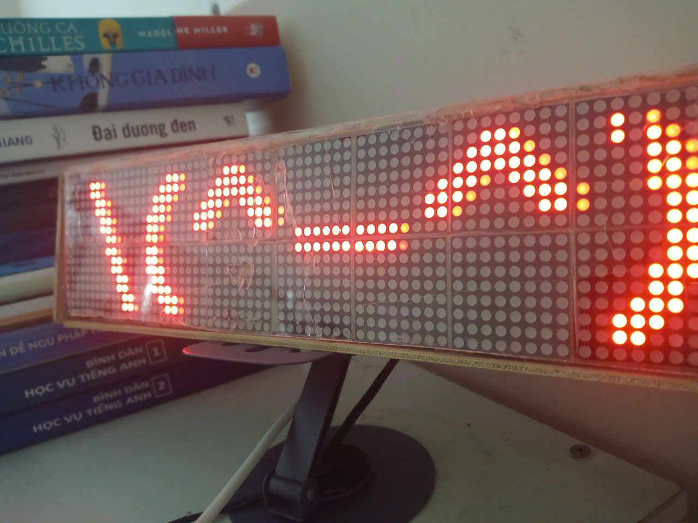

# 🚀 ESP32_Matrix_Led7219_Final

<p align="center">
  
</p>

<p align="center">

<a href="Config.h">
  
</a>

<a href="ESP32_LED_SYSTEM.ino">
  
</a>

<a href="ModeBase.h">
  
</a>

<a href="Scrolling_Text.h">
  
</a>

<a href="Real_Time_Clock.h">
  
</a>

<a href="Temp_Humid.h">
  
</a>

<a href="Mode_Sound.h">
  
</a>

</p>

---

# 📖 Overview

Hệ thống LED Matrix thông minh được phát triển trên nền tảng ESP32 kết hợp lập trình hướng đối tượng (OOP), mang đến khả năng hiển thị trực quan, hiện đại và dễ dàng mở rộng chức năng trong tương lai.

Dự án tích hợp nhiều chế độ hoạt động khác nhau như chạy chữ LED Matrix, đồng hồ thời gian thực, cảm biến nhiệt độ - độ ẩm và hiệu ứng LED theo âm thanh.

---

# ✨ Features

- 🔥 Scrolling Text Display
- ⏰ Real Time Clock
- 🌡️ Temperature & Humidity Monitor
- 🎵 Sound Reactive LED Effects
- ⚡ ESP32 High Performance Control
- 🧠 Object-Oriented Programming Design

---

# 🛠 Hardware

| Component | Description |
|---|---|
| ESP32 | Main Controller |
| MAX7219 | LED Matrix Driver |
| RTC Module | Real Time Clock |
| DHT Sensor | Temp & Humidity |
| Sound Sensor | Audio Detection |

---

# 📂 Project Structure

```bash
ESP32_Matrix_Led7219_Final
│── Config.h
│── Globals.h
│── ModeBase.h
│── Scrolling_Text.h
│── Real_Time_Clock.h
│── Temp_Humid.h
│── Mode_Sound.h
│── ESP32_LED_SYSTEM.ino
│── README.md
│
└── image
    └── Photo.jpg
```   
# 🎬 Demo Video

<p align="center">

<a href="https://youtube.com/your-link">
  
</a>

</p>

---
---

# 👨‍💻 Team Members

<p align="center">

<a href="https://github.com/Kazato-ce" style="text-decoration: none;">🔥 Nguyễn Đoàn Thanh Phong</a><br>
<a href="https://github.com/Kazato-ce" style="text-decoration: none;">⚡ Đặng Thế Tú</a><br>
<a href="https://github.com/Kazato-ce" style="text-decoration: none;">🚀 Lý Hoàng Em</a><br>
<a href="https://github.com/Kazato-ce" style="text-decoration: none;">💻 Nguyễn Văn Đức</a><br>
<a href="https://github.com/Kazato-ce" style="text-decoration: none;">🛠 Nguyễn Tiến Đức</a><br>
<a href="https://github.com/Kazato-ce" style="text-decoration: none;">🎵 Nguyễn Tiến Dũng</a><br>

</p>

---